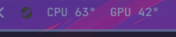
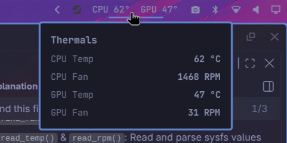

# 

A minimal [Omarchy](https://omarchy.org/) bar widget showing CPU/GPU temperatures,
with a click panel for CPU/GPU temps and fan speeds.





- Bar shows live `CPU 48°  GPU 39°` (slow 10s poll)
- Click to open a panel with CPU temp, CPU fan, GPU temp, GPU fan (2s poll while open)
- One persistent collector process streams readings — no per-tick process spawning
- Reads temperatures and fan speeds:
  - **CPU temp**: `/sys/class/hwmon` (k10temp/zenpower/coretemp)
  - **GPU temp & fan**: Prioritizes `nvidia-smi` for NVIDIA GPUs if available; falls back to `/sys/class/hwmon` (amdgpu/nouveau/nvidia)
  - **Board fans**: ITE/Nuvoton super-IO chips (via hwmon)
- Works best with the `it87` driver on Gigabyte boards (`it87-dkms-git` from AUR, with `ignore_resource_conflict=1`)

## Install

```bash
omarchy plugin add https://github.com/ravithejareddy/thermals.git --enable
```

That clones the plugin into `~/.config/omarchy/plugins/ryu.thermals/`, validates
the manifest, and places the widget on the right side of the bar. Move it with:

```bash
omarchy bar move ryu.thermals --section right
```

Update later with:

```bash
omarchy plugin update ryu.thermals
```

## Remove

```bash
omarchy plugin remove ryu.thermals
```

## Requirements

- No runtime dependencies beyond `bash` — the collector is a plain shell script reading sysfs
- Fan readings require a hwmon driver for your motherboard's Super I/O chip
  (e.g. `it87` or `nct6775`); otherwise fans show "n/a"
